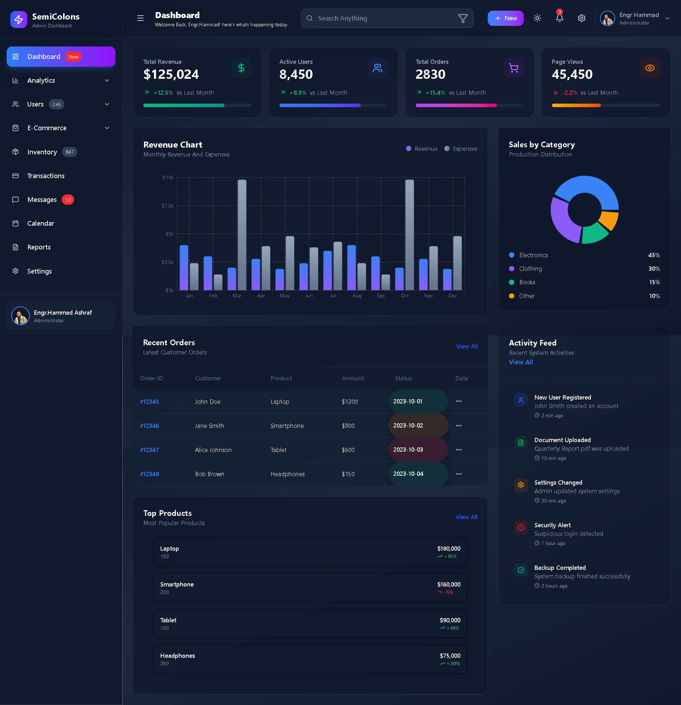

# 🖥️ Semi Colon Admin Dashboard

A modern and fully responsive **Admin Dashboard** built with **React + Vite + Tailwind CSS**.  
This project provides a clean, minimal, and functional UI for managing and visualizing data.

---

## 📌 Table of Contents

- [✨ Features](#-features)
- [📸 Screenshots](#-screenshots)
- [🛠️ Tech Stack](#️-tech-stack)
- [📂 Project Structure](#-project-structure)
- [⚡ Installation & Setup](#-installation--setup)
- [🌙 Dark Mode](#-dark-mode)
- [📌 Roadmap](#-roadmap)
- [🤝 Contributing](#-contributing)
- [📄 License](#-license)

---

## ✨ Features

- ⚡ **React + Vite** – Lightning fast development setup
- 🎨 **Tailwind CSS** – Utility-first responsive design
- 🌙 **Dark Mode** – Easy toggle between light & dark themes
- 🖼️ **Lucide Icons** – Beautiful, consistent icons
- 📊 **Stats Cards** – Show revenue, users, and more
- 🕒 **Activity Timeline** – Track events with timestamps
- 📱 **Responsive Layout** – Works on desktop, tablet, and mobile

---

## 📸 Screenshots

### Dashboard Overview



---

## 🛠️ Tech Stack

- **Frontend:** React (Vite)
- **Styling:** Tailwind CSS
- **Icons:** Lucide React
- **Charts (optional):** Recharts

---

## 📂 Project Structure

├── public/ # Static assets
├── src/
│ ├── components/ # Reusable components
│ ├── context/ # Theme context provider
│ ├── pages/ # Dashboard pages
│ ├── App.jsx # Main app component
│ └── main.jsx # Entry point
├── tailwind.config.js # Tailwind configuration
├── package.json # Project dependencies
└── README.md # Project documentation

---

## ⚡ Installation & Setup

1. **Clone the repository**
   ```bash
   git clone https://github.com/your-username/semi-colon-dashboard.git
   cd semi-colon-dashboard
   ```

---

# Install dependencies

- npm install

- Run development server

- npm run dev

- Build for production

- npm run build

# 🌙 Dark Mode

This project uses Tailwind’s darkMode: "class" strategy.
The ThemeContext provider applies or removes the dark class on the <html> element and stores the user preference in localStorage.

# 📌 Roadmap

- Add authentication (login/register)

- Add charts & analytics

- Add user management

- Add notifications system

# 🤝 Contributing

- Contributions are welcome!

- Fork the project

- Create a new branch (git checkout -b feature/your-feature)

- Commit your changes (git commit -m 'Add new feature')

- Push to the branch (git push origin feature/your-feature)

- Open a Pull Request
